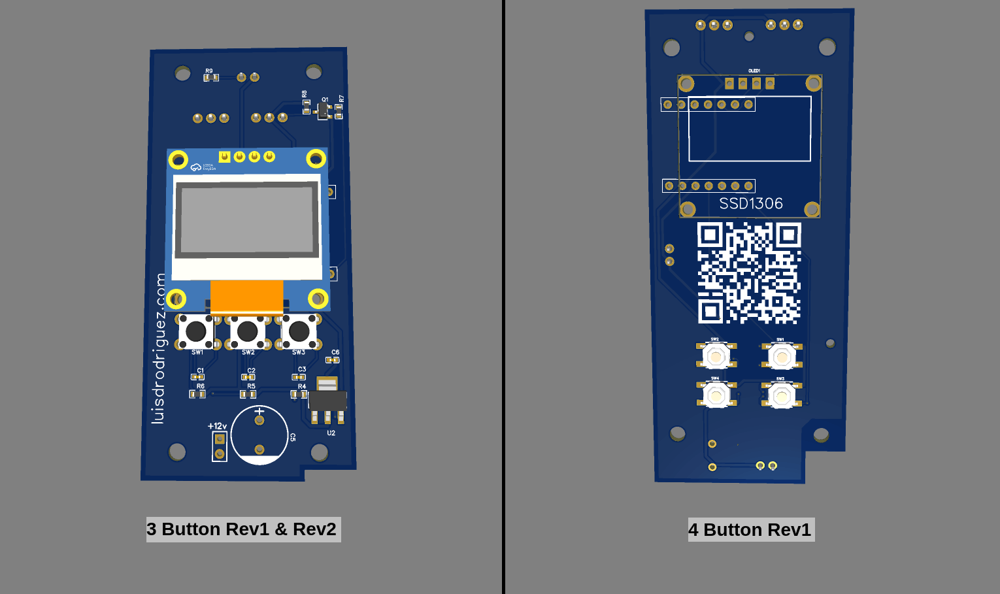

# AC Infinity ESP32 Mods

This repository contains code and instructions to modify the AC Infinity products with an ESP32 microcontroller. The ESP32 is a powerful microcontroller that can be used to control the fan speed, monitor temperature and humidity, and connect to the internet. The modifications described in this repository will allow you to control your fan remotely, set up schedules, and monitor environmental conditions in your grow room or other indoor space.

Get it on [SiloCityLabs Shop](https://shop.silocitylabs.com/products/esp32-module-for-ac-infinity-airtap-t4-t6)

 ## Airtap T-Series ESP32 Mods

Code and instructions to modify the AC Infinity Airtap T-Series inline duct fans with an ESP32 microcontroller.

**Youtube Video:** [Shorts](https://www.youtube.com/shorts/T40RKEEfJKI)

 - Disassembly: Carefully open your AC Infinity vent to access the original PCB.
 - Compare PCB Layout: Match your vent’s PCB layout with the images provided to ensure compatibility with one of the three supported versions.
 - Upload Firmware: Use the provided ESPHome configuration links to upload the correct firmware version to your ESP32 module or alternative firmware compatible with ESP32-c3 module.
 - Install the ESP32 Module:
 - Replace the existing PCB with the ESP32 module.
 - Connect the PWM fans and NTC thermistor to the corresponding terminals on the new PCB.
 - (If needed) Solder the power cable to the correct pads on the PCB.
 - Secure the Module: Reassemble the vent, ensuring that all connections are secure and the module is properly seated.
 - Test Functionality: Power on the vent and check that the display is working and the device connects to your Wi-Fi network.

### How to identify your Generation

3 buttons is Gen 1, 4 buttons is Gen 2.

### Gen 1 Rev 1

This revision of Gen 1 has an aligment issue. When installed you should only use two left screws to secure the PCB. The right screws will not align with the holes. Also includes individual fan control with two PWM outputs.

[ESPHome Configuration](Airtap-Tx/Gen-1/esphome-3btn-rev1.yaml)

This includes a font that needs to be downloaded and placed in the same directory as your configuration file. You can download the font file [here](https://font.download/font/arial)

#### Pinout:

| ESP32 Pin | Function      | Xiao Pin |
|-----------|---------------|----------|
| GPIO2     | PWM           | D0       |
| GPIO3     | PWM           | D1       |
| GPIO4     | Temp          | D3       |
| GPIO6     | OLED SDA      | D4       |
| GPIO7     | OLED SCL      | D5       |
| GPIO8     | Button Up     | D8       |
| GPIO9     | Button Down   | D9       |
| GPIO10    | Button Toggle | D10      |

#### Features
 - 2x PWM Output
 - 1x Temperature Sensor
 - 1x Display
 - 3x Button

### Gen 1 Rev 2

This is the second revision of Gen 1. It has the same layout with fixed hole aligment. The second PWM output was removed and both fans are controlled from a single PWM output.

[ESPHome Configuration](Airtap-Tx/Gen-1/esphome-3btn-rev2.yaml)

This includes a font that needs to be downloaded and placed in the same directory as your configuration file. You can download the font file [here](https://font.download/font/arial)

#### Features
 - 1x PWM Output
 - 1x Temperature Sensor
 - 1x Display
 - 3x Button

#### Pinout:

| ESP32 Pin | Function      | Xiao Pin |
|-----------|---------------|----------|
| GPIO2     | PWM           | D0       |
| GPIO4     | Temp          | D3       |
| GPIO6     | OLED SDA      | D4       |
| GPIO7     | OLED SCL      | D5       |
| GPIO8     | Button Up     | D8       |
| GPIO9     | Button Down   | D9       |
| GPIO10    | Button Toggle | D10      |

### Gen 2 Rev 1

This is the second Generation of Airtap series. AC Infinity introduced a larger display, 4 buttons, bluetooth and a new PCB layout. This revision has a single PWM output and a temperature sensor.

[ESPHome Configuration](Airtap-Tx/Gen-2/esphome-4btn-rev1.yaml)

#### Features
 - 1x PWM Output
 - 1x Temperature Sensor
 - 1x Display
 - 4x Button

#### Pinout:

| ESP32 Pin | Function      | Xiao Pin |
|-----------|---------------|----------|
| GPIO2     | PWM           | D0       |
| GPIO4     | Temp          | D3       |
| GPIO6     | OLED SDA      | D4       |
| GPIO7     | OLED SCL      | D5       |
| GPIO20    | Button Up     | D7       |
| GPIO8     | Button Down   | D8       |
| GPIO9     | Button Toggle | D9       |
| GPIO10    | Button Menu   | D10      |

 ## Availability
You can get the assembled boards in my [Shop](https://shop.silocitylabs.com/products/esp32-module-for-ac-infinity-airtap-t4-t6)

## Certifications

This project is certified by the [Open Source Hardware Association (OSHWA)](https://certification.oshwa.org/us002672.html)

